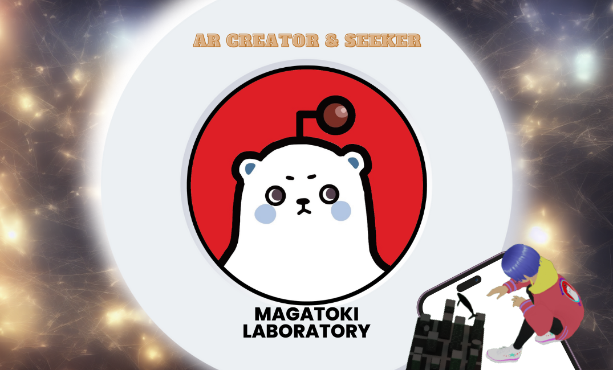
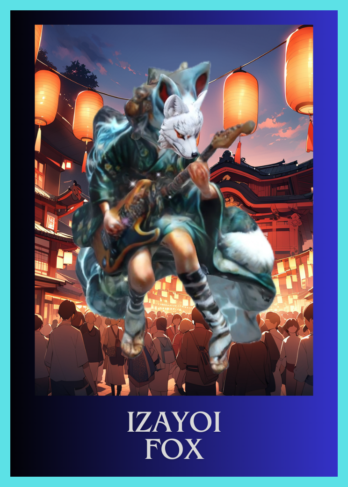

<p align="center">
  
</p>

---

# 🚀 Next-Gen AI & AR Business Card

ブラウザだけで動作する、AIコンシェルジュを搭載した次世代型AR名刺システムです。
「名刺を渡す」という体験を「デジタルな対話と交流」へと進化させました。

---

## ✨ 主な機能

- **Web-based AR**: 専用アプリ不要。スマホのブラウザで名刺（マーカー）にかざすだけで3Dアバターと紹介動画が浮かび上がります。
- **AI Concierge**: OpenAI APIを統合。特定の「合言葉」を含めたメッセージを送ると、AIが私に代わって詳細案内を行います。
- **Real-time SNS Board**: Firebase Firestoreを活用したリアルタイム掲示板。投稿されたメッセージへの「いいね」はランキングに反映されます。
- **Dynamic Greeting**: アクセスした時間帯（朝・昼・夜）に合わせて、AR上のメッセージが自動で変化します。

---

## 🛠 テクノロジー・スタック

### Frontend
- **Mind-AR / A-Frame**: WebXR（AR）フレームワーク
- **JavaScript**: UI制御・リアルタイム通信

### Backend / Cloud
- **Firebase Functions (Gen2)**: サーバーレスAPI / OpenAI連携
- **Cloud Firestore**: リアルタイムNoSQLデータベース
- **Firebase Hosting**: コンテンツ配信
- **OpenAI API**: 対話型AIエンジン

---

---

## 📸 ARマーカー（デモ用）

AR体験をするには、スマホで公開URLを開き、PC画面に表示された以下のマーカーにかざしてください。

| メイン名刺 (Index 0) | SNS・掲示板用 (Index 1) |
| :---: | :---: |
|  |  |

---


---

## 🚀 セットアップ（開発者向け）

このプロジェクトを自身の環境で動作させるための手順です。

### 1. Firebaseの設定
`sns.html` および `index.html` 内の `firebaseConfig` を、ご自身のプロジェクト設定に書き換えてください。

```javascript
const firebaseConfig = {
  apiKey: "XXXXX",
  authDomain: "XXXXX",
  projectId: "XXXXX",
  storageBucket: "XXXXX",
  messagingSenderId: "XXXXX",
  appId: "XXXXX"
};
