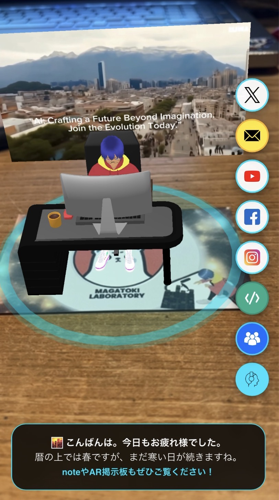

  

---
# 🚀 Next-Gen AI & AR Business Card

ブラウザだけで動作する、AIコンシェルジュを搭載した次世代型AR名刺システムです。
「名刺を渡す」という体験を「デジタルな対話と交流」へと進化させました。

---

## ✨ 主な機能

- **Web-based AR**: 専用アプリ不要。スマホのブラウザでQRコードを読み取り、名刺にかざすだけで3Dアバターと紹介動画が浮かび上がります。
- **AI Concierge**: OpenAI APIを統合。特定の「合言葉」を含めたメッセージを送ると、AIが私に代わって自己紹介や詳細案内を行います。
- **Real-time SNS Board**: Firebase Firestoreを活用したリアルタイム掲示板。投稿されたメッセージへの「いいね」が即座にランキングに反映されます。
- **Dynamic Greeting**: アクセスした時間帯（朝・昼・夜）や季節に合わせて、AR上のメッセージが自動で変化します。
- **Multi-Platform Link**: X, Instagram, YouTube, noteなど、各プラットフォームへスマートに誘導します。

## 🛠 テクノロジー・スタック

### Frontend
- **Mind-AR / A-Frame**: WebXR（AR）フレームワーク
- **JavaScript (ES6+)**: インタラクティブ実装・UI制御

### Backend / Cloud
- **Firebase Functions (Gen2)**: サーバーレスAPI（Node.js）
- **Cloud Firestore**: リアルタイムNoSQLデータベース
- **Firebase Hosting**: 高速な静的コンテンツ配信
- **OpenAI API (GPT-4o-mini)**: 対話型AIエンジン

---

## 🚀 使い方
1. このリポジトリをクローンします。
2. Firebaseプロジェクトを作成し、FirestoreとFunctionsを有効にします。
3. `firebase deploy` を実行し、生成されたURLにアクセスして名刺（マーカー）をスキャンしてください。

---
*Created with a focus on merging traditional communication with cutting-edge technology.*
